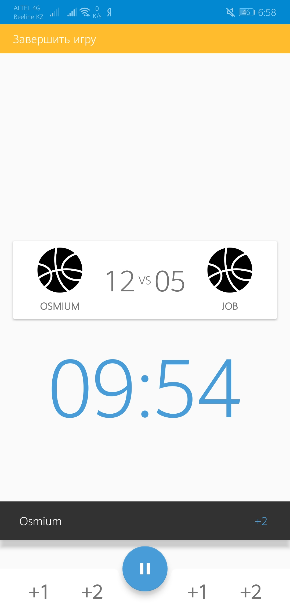

# ABTAdmin
Приложение удобно использовать в различных уличных соревнованиях по баскетболу, футболу и т.п. Через приложение можно записывать победителей, сами команды, выводить очки, следить за самой игрой (добавляя очки забитых голов). 
<strong>Для данного приложения имеется свои не реализованные идеи.</strong>

## Sreenshots
<table>
  <tbody>
    <tr>
      <td align="center" valign="middle">
        
      </td>
      <td align="center" valign="middle">
        
      </td>
      <td align="center" valign="middle">
        
      </td>
    </tr>
    <tr>
      <td align="center" valign="middle">
        
      </td>
      <td align="center" valign="middle">
        
      </td>
      <td align="center" valign="middle">
        
      </td>
    </tr>
  </tbody>
</table>

## License

 	 Copyright 2019 FromSi

 	 Licensed under the Apache License, Version 2.0 (the "License");
 	 you may not use this file except in compliance with the License.
 	 You may obtain a copy of the License at

 	     http://www.apache.org/licenses/LICENSE-2.0

 	 Unless required by applicable law or agreed to in writing, software
	 distributed under the License is distributed on an "AS IS" BASIS,
 	 WITHOUT WARRANTIES OR CONDITIONS OF ANY KIND, either express or implied.
 	 See the License for the specific language governing permissions and
 	 limitations under the License.
